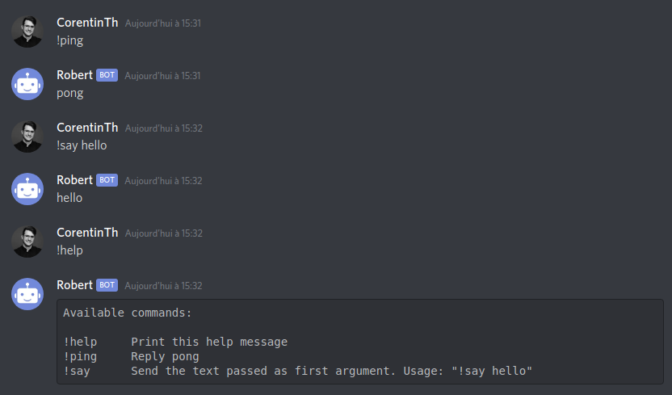

<p align="center">
    <a href="https://github.com/CorentinTh/discot/actions"></a>
</p>

Create simple, yet powerful discord bots focusing on commands.

## What is it ?
**Discot** is a wrapper around [discord.js](https://discord.js.org/) to simplify the creation of server bots. It permists to focus on the creation of commands instead of spending time working with discord's API.

## Usage
### Installation
**Discot** can be installed using yarn or npm.

```shell
npm install discot
# or
yarn add discot
```
### Example
```javascript
const token = 'your_token';
const bot = new Bot({token});
```
Or, using environnment variable:
```javascript
const bot = new Bot({
    token: 'discord_token', // default value: process.env.DISCORD_TOKEN
    prefix: '!'             // default value: '!'
});

bot.addCommand({
        name: 'ping',
        description: 'Reply pong',
        action: message => message.channel.send('pong')
    })
    .addCommand({
        name: 'say',
        description: 'Send the text passed as first argument. Usage: "!say hello"',
        action: (message, args) => message.channel.send(args[0]),
        requiredArgCount: 0
    })
    .start(() => console.log('Bot started.'));
```



`message` in the `action` method for a command is the object from [discord.js](https://discord.js.org/#/docs/main/stable/class/Message) 

### API
#### Bot constructor
```javascript
const bot = new Bot({
    token: 'discord_token', // default value: process.env.DISCORD_TOKEN
    prefix: '!'             // default value: '!'
});
```
Set your discord token in the env variable **DISCORD_TOKEN** (use [dotenv](https://www.npmjs.com/package/dotenv)).

#### bot.addCommand(command)
```javascript
bot.addCommand({
    name: 'ping',              // name of the command, the one to type
    description: 'Reply pong', // description displayed in the help message
    action: message => message.channel.send('pong'), // action to execute when the command is triggered
    requiredArgCount: 1        // amount of required parameters for the command for validation
})                             
```
`message` in the `action` method for a command is the object from [discord.js](https://discord.js.org/#/docs/main/stable/class/Message) 

#### bot.start(callback?)
```javascript
bot.start(() => console.log('Bot started.'))
```
The callback is triggered when the bot is started.

## Contribute
**Pull requests are welcome !** Feel free to contribute.

## Credits
Coded with ❤️ by [Corentin Thomasset](//corentin-thomasset.fr).

## License
This project is under the [MIT license](./LICENSE).
